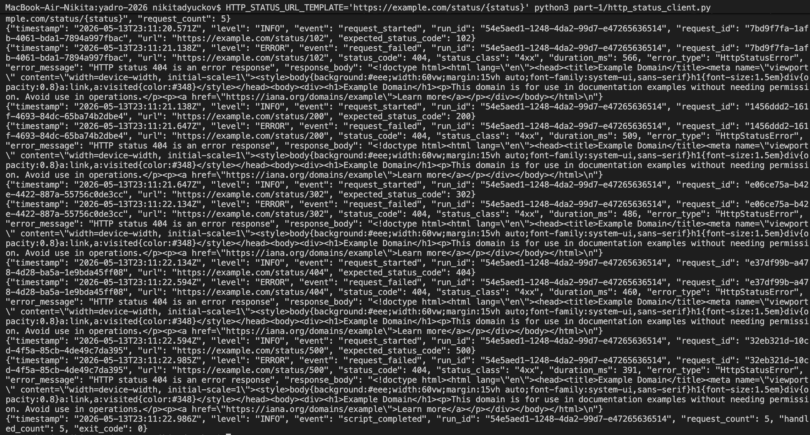
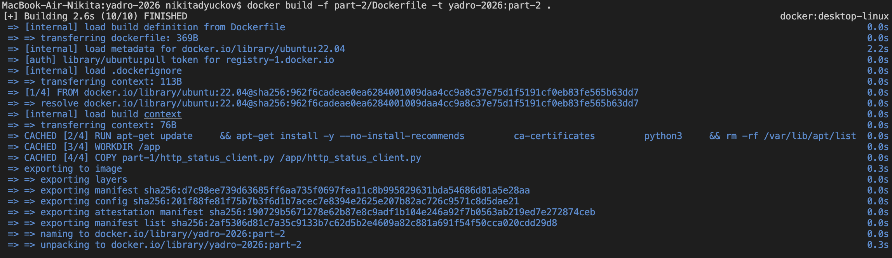
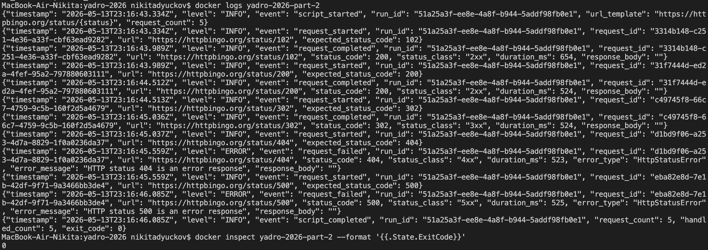
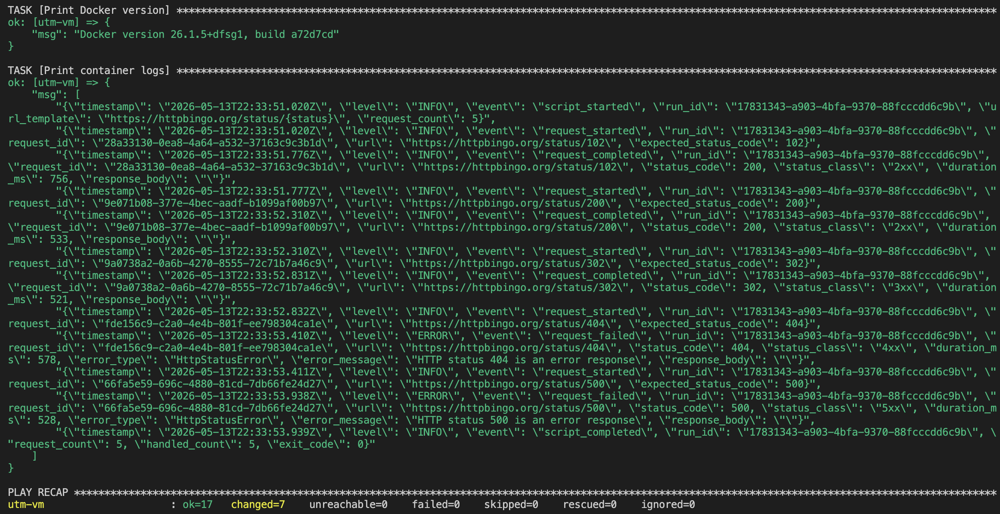
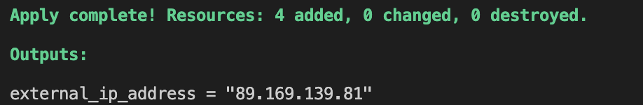
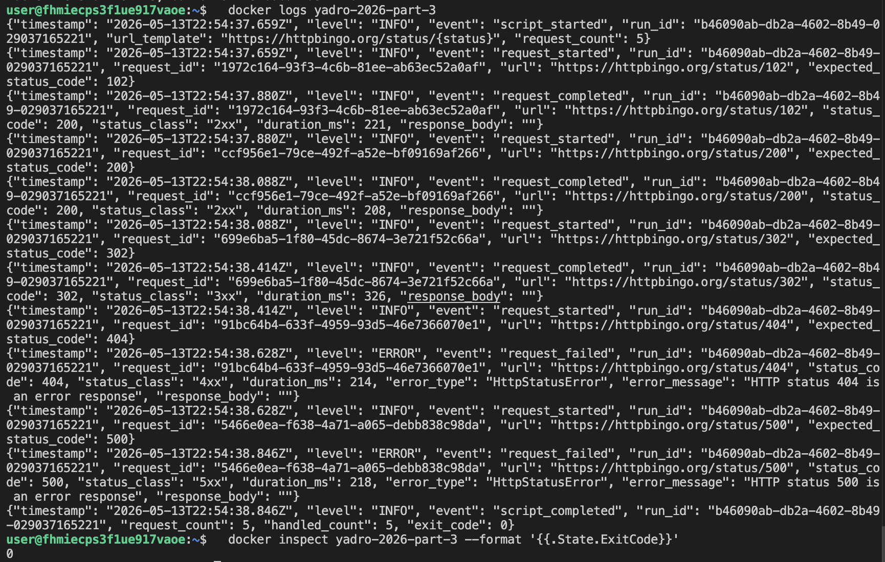

# YADRO 2026: Bash/Python, Docker, Ansible

Репозиторий содержит решение из трех частей:

- `part-1` — Python-скрипт для HTTP-запросов и обработки статус-кодов.
- `part-2` — Docker-образ на базе `ubuntu:22.04` для запуска скрипта.
- `part-3` — Ansible-автоматизация установки Docker и проверки контейнера.

## Раздел 1

Скрипт отправляет пять HTTP-запросов, логирует успешные ответы `1xx`, `2xx`, `3xx` и обрабатывает `4xx`/`5xx` как ожидаемые исключительные ситуации.

```bash
python3 part-1/http_status_client.py
```

Логи выводятся в консоль в формате JSON Lines. Для устойчивости к недоступности основного внешнего сервиса URL можно переопределить:

```bash
HTTP_STATUS_URL_TEMPLATE='https://httpbingo.org/status/{status}' \
  python3 part-1/http_status_client.py
```

## Раздел 2

Dockerfile собирает образ на базе `ubuntu:22.04`, устанавливает `python3` и `ca-certificates`, копирует скрипт из первой части и запускает его при старте контейнера.

```bash
docker build -f part-2/Dockerfile -t yadro-2026:part-2 .
docker run --name yadro-2026-part-2 yadro-2026:part-2
docker logs yadro-2026-part-2
```

При проблемах с основным HTTP-сервисом:

```bash
docker run --name yadro-2026-part-2-alt \
  -e HTTP_STATUS_URL_TEMPLATE='https://httpbingo.org/status/{status}' \
  yadro-2026:part-2
```

## Раздел 3

Ansible playbook устанавливает Docker на Ubuntu/Debian-хосте, добавляет пользователя в группу `docker`, запускает сервис, собирает образ на целевом хосте, запускает контейнер и автоматически проверяет результат через `docker logs` и exit code.

```bash
cd part-3
ansible all -m ping
ansible-playbook playbook.yml
```

Для удаленного сервера inventory заполняется так:

```ini
[targets]
yc-vm ansible_host=<external_ip> ansible_user=<user> ansible_ssh_private_key_file=~/.ssh/id_ed25519
```

## Дополнительно

- Добавлено структурированное логирование JSON Lines с `run_id`, `request_id`, длительностью запроса, классом статуса и деталями ошибок.
- Скрипт не прекращает работу на ожидаемых `4xx`/`5xx`, а обрабатывает все пять запросов и возвращает итоговый exit code.
- Docker-сборка использует `.dockerignore`, чтобы не передавать лишние файлы в build context.
- Ansible выполняет не только ручной сценарий `docker logs`, но и автоматическую проверку: exit code контейнера равен `0`, а в логах есть `script_completed`.
- Решение проверено на локальной VM и на удаленной VM в Yandex Cloud, созданной через Terraform.

## Скриншоты

### 1. Запуск Python-скрипта



### 2. Сборка Docker-образа



### 3. Проверка Docker logs



### 4. Ansible на локальной VM



### 5. Создание VM через Terraform



### 6. Ручная проверка на Yandex Cloud VM



## Проверка после Ansible

На целевом хосте:

```bash
docker --version
docker logs yadro-2026-part-3
docker inspect yadro-2026-part-3 --format '{{.State.ExitCode}}'
```

Ожидаемый код завершения контейнера: `0`.
